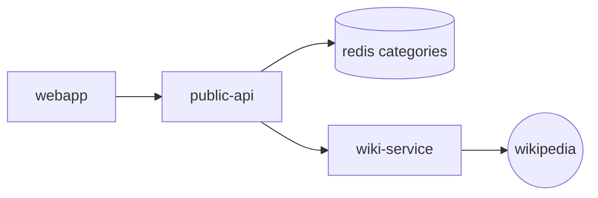
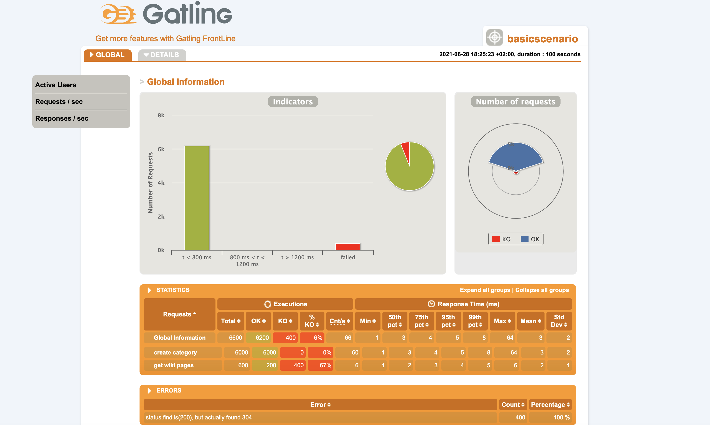

# Microlearning load test

Source code for load test of the microlearning demo project using `Gatling`

## Prerequisites

- maven
- docker
- doocker-compose
  
## Goals

In this demo we will execute two workloads scenarios against the microlearning application with Gatling tool.

## Demo project: Microlearning

### Overview

Microlearning is demo project for training purpose. The idea is to display a list of random wiki pages to the user based on a set of categories stored in a redis database.

### Microservices

- [Microlearning-api](https://github.com/bdridi/microlearning-api)
  - the public api  
- Microlearning redis 
  - the database to store categories
- [Microlearning web application](https://github.com/bdridi/microlearning-webapp)
- [Microlearning-wiki service](https://github.com/bdridi/microlearning-wiki)
  - search on wikipedia a random pages with specific category.

### Architecture



### How to launch the microlearning services

Please execute the following docker-compose file [https://github.com/bdridi/workcale-experiments/blob/master/compose/docker-compose.yaml](https://github.com/bdridi/workcale-experiments/blob/master/compose/docker-compose.yaml)

```bash
docker compose -f services.yaml up
```

## Execute scenarios

Once the microservices are up and running we can run our tests scenarios.

### Inject users per second during a period of time

The first scenario will inject 2 users per seconds during 100s.

bash
```
mvn clean gatling:test -Dgatling.simulationClass=UsersPerSecondScenario
```

### Inject a ramp users during a period of time

The second scenario will inject a ramp users during 100s. 

bash
```
mvn clean gatling:test -Dgatling.simulationClass=RampUsersScenario
```

As the test is running, you should be viewing an output as follows : 

```bash
================================================================================
2021-06-28 18:51:39                                          95s elapsed
---- Requests ------------------------------------------------------------------
> Global                                                   (OK=2945   KO=190   )
> create category                                          (OK=2850   KO=0     )
> get wiki pages                                           (OK=95     KO=190   )
---- Errors --------------------------------------------------------------------
> status.find.is(200), but actually found 304                       190 (100.0%)

---- demo ----------------------------------------------------------------------
[######################################################################-   ] 95%
          waiting: 4      / active: 1      / done: 95    
================================================================================
```

## Reports

The gatling report is generated under `target/gatling`

- Example of resulted report
  
